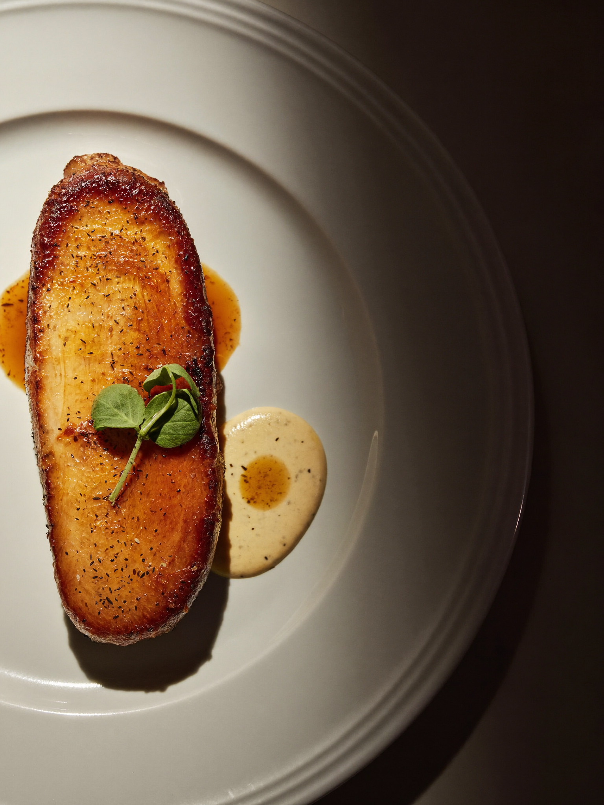

# higgsfield-gastronomy-prompts

<div align="center">

<br/><sub><code>soul_2</code> &nbsp;·&nbsp; Poulet de Bresse supreme &nbsp;·&nbsp; 45° angle, 3200K single overhead spot &nbsp;·&nbsp; 1536×2048 &nbsp;·&nbsp; seed 224324</sub>
</div>

<br/>

**Gastronomy photography is a conversation between a chef's intention and a photographer's interpretation — and AI content is the first medium that can do both simultaneously.**

Every plate is a composition that someone spent years learning to make. The photography has to show not just what it looks like but what it means — the restraint in the negative space, the precision of the sauce work, the geometry of the garnish. Get it wrong and it looks like food. Get it right and it looks like a restaurant worth three hours of your life and €300.

This repository documents the specific decisions — plating angle, light colour temperature, surface selection, sauce behaviour, negative space management — that make AI gastronomy content indiscernible from editorial food photography shot in a Michelin kitchen.

Built alongside **[higgsfield-luxury-prompts](https://github.com/AlexianIulian/higgsfield-luxury-prompts)** — same methodology, gastronomy application.

---

## Why gastronomy is the hardest editorial category

Every other luxury category photographs an object. Gastronomy photographs a *decision* — the chef's intention crystallised in a specific arrangement that will never exist again in exactly this form.

**Four problems unique to this category:**

| Problem | Why it's hard | Solution |
|---|---|---|
| **Colour temperature** | Food is uniquely sensitive to light temperature — warm light makes it appetising, cold light makes it clinical, wrong temperature makes it unrecognisable | Always specify K, always test at ±200K |
| **Sauce behaviour** | Liquid elements (sauces, consommés, oils) require specific light to show their texture and depth — most prompts render them flat | Specify `specular highlight on sauce surface`, `depth visible in consommé` |
| **Plating geometry** | Chefs compose on a plate as deliberately as a painter on a canvas — the AI must preserve that geometry, not "improve" it | Describe the arrangement explicitly, not vaguely |
| **Negative space** | Fine dining plating uses the white of the plate as part of the composition — the model will fill it | Explicit instruction: `wide negative space on plate, do not fill` |

---

## Register map

| Register | Key references | Angle | Light | Surface |
|---|---|---|---|---|
| **French haute cuisine** | Robuchon · Ducasse · Le Bernardin | 45° | Warm diffuse 3600K | Linen · aged oak |
| **Nordic / new Nordic** | Noma · Geranium · Frantzén | 80° near-overhead | Flat overcast 5200K | Stone · birch · foraged element |
| **Japanese kaiseki** | Kikunoi · Ryugin · Den | Variable by course | Natural window 5000K | Ceramic · lacquer · bamboo |
| **Contemporary bistro** | Frenchie · Septime · Dilia | 45° three-quarter | Ambient warm 3800K | Marble · concrete · linen |
| **Ingredient raw** | René Redzepi ethos · pre-service | Extreme close overhead | Raking natural | Dark slate · unfinished wood |

---

## Register: French haute cuisine

**The brief:** a single portion. One protein, one sauce, one gesture of garnish. The white of the plate is not empty — it is the negative space that makes the food read.

**What makes this register work:**

| Element | What to write | What it does |
|---|---|---|
| Protein | `perfectly seared golden skin` · `cross-section of medium-rare` | Surface texture is the subject — the model must render crust, not meat |
| Porcelain | `white Limoges porcelain, wide rim` · `Bernardaud coupe plate` | Wide rim creates built-in negative space the model is less likely to fill |
| Sauce | `sauce poured at 6 o'clock position only` · `thin jus, specular highlight on surface` | Clock-face positioning forces geometry — `poured` prevents the flood default |
| Garnish | `microherb at 2 o'clock, three leaves only` | Quantity specified prevents the model from overfilling the plate |
| Angle | `45° camera angle` | The haute cuisine default — shows height, crust texture, and sauce depth simultaneously |
| Light | `warm 3200K single overhead spot, no fill` | Warm light makes protein skin read as appetising — cold light kills it |
| Negative space | `deep negative space on right half of plate` | Forces the model away from centred composition toward editorial asymmetry |

**Full tested prompt** — produced the image above:

```
Poulet de Bresse breast supreme, perfectly seared golden skin,
single portion on white Limoges porcelain,
sauce poured at 6 o'clock position only,
microherb garnish at 2 o'clock,
45° camera angle, warm 3200K single overhead spot,
deep negative space on right half of plate,
photorealistic haute cuisine photography, Noma editorial aesthetic,
shot on Hasselblad H6D-400C, tack sharp on skin texture,
no text, no props, no background elements
```

**Seed:** 224324 · **Model:** soul_2 · **Ratio:** 3:4

**Register variations by protein:**

```
"Turbot fillet, skin side up"         → cooler 4200K, skin texture finer, sauce more restrained
"Soufflé au chocolat, 74%"            → horizontal/eye level — height is the argument, not composition
"Langoustine tail, raw coral visible" → blue hour natural light 5500K, coral reads pink not orange
"Côte de bœuf, dry-aged 60 days"     → darker plate, deeper shadow, smoke note at `wisps of steam`
"Seasonal vegetable course, full veg" → shift to 80° near-overhead, cooler, more Nordic territory
```

**Why `Noma editorial aesthetic` works in a French haute cuisine prompt:**

It is a reference collision. Invoking Noma activates the model's training on editorial restraint — clean plate, generous white space, geometric precision — without activating Noma's plating codes (no foraged element, no moss, no rough stone). The French protein keeps the register French; Noma keeps the framing editorial rather than commercial.

---

## The plating-angle system

Camera angle in gastronomy carries meaning that no other category has.

| Angle | What it shows | Register |
|---|---|---|
| **Overhead 90°** | Symmetry and geometry of the plate composition | Japanese kaiseki, Nordic flat compositions |
| **80° near-overhead** | Depth visible, volume visible, still shows full plate | Nordic, contemporary French |
| **60°** | Balance of composition and volume — standard editorial | Bistronomy, modern French |
| **45° three-quarter** | Classic food editorial — shows height, texture, garnish drama | Haute cuisine, Michelin editorial |
| **Horizontal / eye-level** | Height as the argument — towers, mousses, stacked elements | Architectural plating, Tom Kerridge register |

---

## Structure

```
higgsfield-gastronomy-prompts/
├── SYSTEM.md              ← plating as composition, colour temperature, sauce behaviour
├── registers/
│   ├── haute-cuisine.md   ← Ducasse · Robuchon · Le Bernardin · 45° · warm
│   ├── new-nordic.md      ← Noma · Geranium · overhead · cold natural light
│   └── ingredient-raw.md  ← mise en place · pre-service · the ingredient truth
├── mise-en-place/
│   ├── knife-work.md      ← precision cuts · prep surface · raking light
│   └── raw-materials.md   ← market produce · ingredient studies
├── lighting/
│   ├── overhead.md        ← diffuse top light · Nordic register
│   ├── raking.md          ← side light · texture · sauce depth
│   └── backlit.md         ← consommé · broth · translucent element
└── reels/
    └── plating-reveal.md  ← the moment of completion · 6–10s · Seedance 2.5
```

---

## Core principle

> Show the chef's intention. The plate is a composition that exists once.

The AI doesn't invent the dish — it reveals it. Every prompt decision should serve the logic of the plating, not impose an external aesthetic on it.

---

## Status

`active` — built alongside a live production studio.

<div align="center">

built by [@AlexianIulian](https://github.com/AlexianIulian)

</div>
